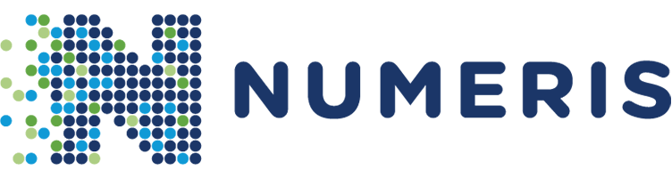

<!-- Numeris GitHub project readme file -->
<a name="readme-top"></a>

<!-- PROJECT LOGO -->
<br />
<div align="center">
  <a href="logo.png">
    
  </a>

  <h3 align="center">Common-QCAutomation-Conversion-app</h3>

  <p align="center">
    Common QCAutomation Conversion application repository.
    <!-- <br />
    <a href="link-to-documentation"><strong>Explore the docs »</strong></a> -->
    <br />
    <br />
    <a href="https://github.com/Numeris-SoftwareEngineering/Common-QCAutomation-Conversion-app/compare/dryrun...dev?template=release.md">Create Release PR: DEV -> DRYRUN</a>
    ·
    <a href="https://github.com/Numeris-SoftwareEngineering/Common-QCAutomation-Conversion-app/compare/main...dryrun?template=release.md">Create Release PR: DRYRUN -> MAIN</a>    
  </p>
</div>


<!-- ABOUT THE PROJECT -->
## About The Project

[![Product Name Screen Shot][product-screenshot]](#)

Use this section to describe the project. People should get understanding what is the goal and functionality of the project.

The main functionality:
* Read .dem files from FSx drive
* Convert to CSV file
* Save to S3 Bucket
* Trigger AWS Glue job

### Built With

The list of technologies (frameworks/libraries) used for the project implementation.

* .NET Core
* AWS SDK
* AWS DynamoDB
* AWS S3 Bucket
* AWS FSx drive

<!-- GETTING STARTED -->
## Project setup

### Prerequisites

What do i need to do to use a software:
* tool
  ```
  execute code
  ```

### Installation

_Installation instructions._

1. Do this
2. Do other
   ```sh
   execute script
   ```
3. Install NPM packages
   ```sh
   npm install
   ```

<!-- USAGE EXAMPLES -->
## Usage

Use this space to show useful examples of how a project can be used. Additional screenshots, code examples and demos work well in this space. You may also link to more resources.


<p align="right">(<a href="#readme-top">back to top</a>)</p>

<!-- MARKDOWN LINKS & IMAGES -->
<!-- https://www.markdownguide.org/basic-syntax/#reference-style-links -->
[product-screenshot]: images/product-screenshot.png
